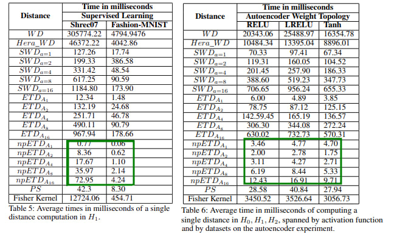

# A class of topological pseudodistances for fast comparison of Persistence Diagrams

In this repo we implement the code of the paper "A class of topological pseudodistances for fast comparison of Persistence Diagrams". Accepted for oral presentation and poster on the main track of AAAI24.

### Abstract

Persistence diagrams (PD)s play a central role in topological data analysis, and are used in an ever increasing variety of applications. The comparison of PD data requires computing comparison metrics among large sets of PDs, with metrics which are accurate, theoretically sound, and fast to compute. Especially for denser multi-dimensional PDs, such comparison metrics are lacking. While on the one hand, Wasserstein-type distances have high accuracy and theoretical guarantees, they incur high computational cost. On the other hand, distances between vectorizations such as Persistence Statistics (PS)s have lower computational cost, but lack the accuracy guarantees and in general they are not guaranteed to distinguish PDs (i.e. the two PS vectors of different PDs may be equal). In this work we introduce a class of pseudodistances called Extended Topological Pseudodistances (ETD)s, which have tunable complexity, and can approximate Sliced and classical Wasserstein distances at the high-complexity extreme, while being computationally lighter and close to Persistence Statistics at the lower complexity extreme, and thus allow users to interpolate between the two metrics. We build theoretical comparisons to show how to fit our new distances at an intermediate level between persistence vectorizations and Wasserstein distances. We also experimentally verify that ETDs outperform PSs in terms of accuracy and outperform Wasserstein and Sliced Wasserstein distances in terms of computational complexity.

### Main goal
The goal was to propose the Extended Topology (pseudo)Distance (ETD). The implementation is located in utilities/extended_topology_distance.py
The unit contains a small set of tests comparing naive implementation versus the faster implementation. The rest of the repo si devoted to the experiment to compare this distance with Wasserstein based distances and Persistence Statistics.



Here are an usage example, considering that we have the resulting persistence diagrams on Schrec07 dataset in the predefined location.
If not, any two persistence diagrams can be used instead of P1 and P2.
```python

from utilities.extended_topology_distance import ExtendedTopologyDistanceHelper, FastExtendedTopologyDistanceHelper
from utilities.directoy_helper import DirectoryHelper
from utilities.tda_helper import TDAHelper
import random

# we load all pds from Shrec07 that are the more heavily denser
overall_path = "results/SupervisedLearningApp/Shrec07Processor/topological_info"

pdiag_files_train = DirectoryHelper.get_all_filenames(overall_path,
                                                      file_pattern="pd_train",
                                                      ignore_pattern=".png")
random.seed(42)
# choosing 20 pdiag filenames
subset_pdiags = random.sample(pdiag_files_train, 20)

train_pdiags = TDAHelper.get_all_pdiagrams(pdiag_files_train)

pdsize = len(train_pdiags)

angle_set = ExtendedTopologyDistanceHelper.compute_angle_dict()

for i in range(pdsize):
    PD1 = train_pdiags[i]
    PPD1 = ExtendedTopologyDistanceHelper.get_dprojection(PD1)
    for j in range(i+1, pdsize):
        PD2 = train_pdiags[j]
        # get basic etd in each homology group
        etd_a1 = ExtendedTopologyDistanceHelper.get_basic_etd(PD1, PD2, p=2)
        fetd_a1 = FastExtendedTopologyDistanceHelper.get_basic_etd_new(PD1, PD2, p=2)
        
        etda = {}
        etda_precompute = {}
        # get etda
        for angle_name in angle_set:         
            etda[angle_name] = ExtendedTopologyDistanceHelper.get_etd_alpha(PD1, PD2, p=2, angle=angle_set[angle_name])
            # we can use precomputed projections of PD1 computed once, so it will compute only PD2 projection
            etda_precompute[angle_name] = ExtendedTopologyDistanceHelper.get_etd_alpha(PD1, PD2, p=2, 
                                                                                       angle=angle_set[angle_name], 
                                                                                       P11=PPD1)
            # we can do the same thing with the faster version
```

### Overview

We run two applications:

1. Supervised Learning App: Classification of Outex Dataset, Shrec07, 
2. Autoencoder weight Topology App

inside each folder we provide corresponding explanations. 

### Dependencies Installation 

1. create the environment

conda create --name etd_aaai24 python=3.11

2. activate it

conda activate aaai24

3. Install dependencies

 pip install scikit-learn

 pip install gudhi
 
 pip install pot
 
 #includes pot-0.9.3
 
 pip install persim
 
 pip install seaborn
 
 pip install torch
 
 In general "pip install <package_name>" will install any missing package

### Execute

If you are interested into execute a specific file. It is important to go to the root path of this repo

cd /REPO/ROOT/PATH/aaai2024_etd_src/
export PYTHONPATH=$PWD:PYTHONPATH

### Reference

Rolando Kindelan Nuñez, Mircea Petrache, Mauricio Cerda, Nancy Hitschfeld. "A Class of Topological Pseudodistances for Fast Comparison of Persistence Diagrams". https://arxiv.org/abs/2402.14489

@misc{nuñez2024class,
      title={A Class of Topological Pseudodistances for Fast Comparison of Persistence Diagrams}, 
      author={Rolando Kindelan Nuñez and Mircea Petrache and Mauricio Cerda and Nancy Hitschfeld},
      year={2024},
      eprint={2402.14489},
      archivePrefix={arXiv},
      primaryClass={cs.CG}
}
